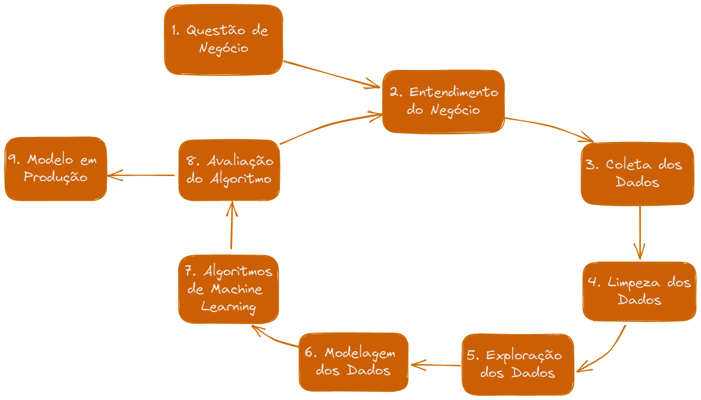

# **Rossmann Sales Forecast**

Este projeto foi orientado pela [Comunidade DS](https://comunidadeds.com/), utilizando os dados disponíveis no [Kaggle](https://www.kaggle.com/competitions/rossmann-store-sales) da Rede de Lojas Rossmann.

**Produto final:**
- [Análises](https://github.com/GustavoBarros11/rossmann_sales_forecast/blob/main/notebook_final.ipynb): Análise Exploratória de Dados
- [APP](https://rossmann-sales-forecast-app.onrender.com/): Previsão de Vendas em Tempo Real com Aprendizado de Máquina (Machine Learning)
- [BotTelegram](http://t.me/gustavos_rossmann_bot): Meio de entrega, lugar onde a solução pode ser acessada 24/7 de qualquer lugar
- [API do Modelo de ML](https://github.com/GustavoBarros11/rossmann_sales_forecast/tree/main/rossmann-api)

# 1. Entendendo o Problema de Negócio
### 1.1. Contexto
> O CFO da empresa fez uma reunião com todos Gerentes de Loja e pediu para que cada um deles trouxesse uma previsão diária das próximas 6 semanas de vendas. Depois desa reunião, todos os Gerentes entraram em contato com você, requisitando uma previsão de vendas de suas lojas.

Ao analisar o contexto, faz sentir julgar que o problema caracterizado acima trata-se de um problema de aprendizado supervisionado, mais especificamente um problema de regressão envolvendo Time-Series.

### 1.2. Planejamento da Solução
Para o desenvolvimento deste projeto, eu utilizei de uma metodologia de desenvolvimento de projetos de ciência de dados chamada CRISP-DM, que caracteriza uma série de passos que devem ser executados ciclicamente, incentivando a exploração, rápida entrega de valor, identificação precoce de impecílios que possam inviabilizar o projeto e dentre outras vantagens.

Segue abaixo uma breve ilustração das principais etapas desse processo:

Além disso, nesta etapa, eu defini qual será o formato da solução, criei uma lista de passos ordenados para a construção completa da solução e identifiquei quais serão os meios de coleta de dados. Tentando seguir um processo critico e analítico de planejamento, focando em planejar primeiro e executar depois.

### 1.3. Premissas do projeto
- Um merge foi executado entre os dados train.csv e store.csv, já que os dados do arquivo store.csv continham informações adicionais para as lojas.
- Lojas com valor de vendas igual a 0 foram removidas;
- Lojas fechadas foram removidas;
- Valores de datas faltantes foram imputadas com o valor da data da amostra.

# 2. Dicionário dos Dados
**Dados Brutos**
Variable | Description
--- | ---
`Id` | An Id that represents a (Store, Date) duple within the test set
`Store` | A unique Id for each store
`DayOfWeek` | Day of week of the sale
`Date` | Date of the sale (daily)
`Sales` | The turnover for any given day (this is what you are predicting)
`Customers` | The number of customers on a given day
`Open` | An indicator for whether the store was open: 0 = closed, 1 = open
`Promo` | Indicates whether a store is running a promo on that day
`StateHoliday` | Indicates a state holiday. Normally all stores, with few exceptions, are closed on state holidays. Note that all schools are closed on public holidays and weekends. a = public holiday, b = Easter holiday, c = Christmas, 0 = None
`SchoolHoliday` | Indicates if the (Store, Date) was affected by the closure of public schools
`StoreType` | Differentiates between 4 different store models: a, b, c, d
`Assortment` | Describes an assortment level: a = basic, b = extra, c = extended
`CompetitionDistance` | Distance in meters to the nearest competitor store
`CompetitionOpenSinceMonth` | Gives the approximate month of the time the nearest competitor was opened
`CompetitionOpenSinceYear` | Gives the approximate year of the time the nearest competitor was opened
`Promo2` | Promo2 is a continuing and consecutive promotion for some stores: 0 = store is not participating, 1 = store is participating
`Promo2SinceWeek` | Describes the calendar week when the store started participating in Promo2
`Promo2SinceYear` | Describes the year when the store started participating in Promo2
`PromoInterval` | Describes the consecutive intervals Promo2 is started, naming the months the promotion is started anew. E.g. "Feb,May,Aug,Nov" means each round starts in February, May, August, November of any given year for that store

**Novas Features Criadas (Feature Engineering)**

Variable | Description
--- | ---
`year` | ano extraido da coluna data
`month` | mês extraido da coluna data
`day` | dia extraido da coluna data
`week_of_year` | semana do ano extraido da coluna data
`competition_since` | ano e mês extraido da coluna competition_open_since_year e competition_open_since_month
`competition_time_month` | quantidade de meses que existe a loja competidora
`promo_since` | ano e semana que começou a promoção
`promo_time_week` | quantidade de semanas que a loja está em promoção
`is_promo` | 0 = não está em promoção, 1 = está em promoção

# 3. Principais Insights
Lista com os principais insights adiquiridos durante a etapa de Análise Exploratória dos Dados.

**H1) Lojas com maior variedade de produtos, em média, deveriam vender mais.**
- ✅ **VERDADEIRO** Nota-se um acréscimo médio nas vendas de 14.32% por nível de assortment.

**H2) Lojas com competidores mais próximos deveriam vender menos, na média.**
- ❌ **FALSO** Não nota-se variação significativa no volume médio de vendas a depender da distância para competidores, nem para mais nem para menos.

**H3) Lojas com competidores à mais tempo deveriam vender mais.**
- ❌ **FALSO** Lojas com competidores a mais tempo tendem a vender menos.

**H4) Lojas com promoções ativas por mais tempo deveriam vender mais.**
- ✅ **VERDADEIRO** Lojas com promocoes ativas por mais tempo, tendem a vender mais, na média. Esse comportamento parece ser constante ao longo de todo o período estudado.

**H6) Lojas com mais promoções consecutivas deveriam vender mais.**
- ❌ **FALSO** Lojas em períodos de promoção Tradicional & Extendida, na média, vendem menos que Lojas em período Tradicional de promoção.

**H7) Lojas abertas durante o feriado de Natal deveriam vender mais.**
- ✅ **VERDADEIRO** Lojas abertas no período de Natal tendem a vender 40.12% a mais, na média, do que em dias regulares.

**H8) Lojas deveriam vender mais ao longo dos anos.**
- ✅ **VERDADEIRO** As lojas apresentaram um aumento médio no volume de vendas YoY (year over year) de 1.99%

**H9) Lojas deveriam vender mais no segundo semestre do ano.**
- ✅ **VERDADEIRO** As lojas apresentaram um aumento médio no volume de vendas no segundo semestre em comparação ao primeiro de 1.99%

**H10) Lojas deveriam vender mais depois do dia 10 de cada mês.**
- ❌ **FALSO** Após o dia 10 de cada mês, as vendas são em média 7% menores. Além disso, nota-se que os picos de vendas estão após o dia 30 do mês e nos primeiros dias do seguinte.

**H11) Lojas deveriam vender menos aos finais de semana.**
- ✅ **VERDADEIRO** Lojas vendem cerca de 22,6% mais, na média, nos fins de semana do que em dias regulares da semana.

**H12) Lojas deveriam vender menos durante os feriados escolares.**
- ✅ **VERDADEIRO** Lojas vendem cerca de 4,4% mais, na média, em dias de feriados escolares do que em outros dias.

# 4. Performance dos Algoritmos de Machine Learning
Dado a questão de negócio apresentada, temos então um problema de Regressão uma vez que a variável resposta deve ser um valor real (no nosso caso, o valor das vendas de cada loja)

Assim, foram realizados testes com 4 algoritmos onde o que apresentou a melhor performance foi selecionado para o modelo

- Uma vez que ainda não sabemos se a natureza do fenômeno de vendas é linear ou não linear, selecionamos 2 algoritmos lineares e 2 não lineares.

Os algoritmos selecionados para o teste foram:

- Linear Regression
- Lasso (Linear Regressor Regularizaded)
- Random Forest
- XGBoost

Para avaliação dos algoritmos, foi utilizada uma variação do método de Cross-Validation para Time-Series, onde ao invés de fazer uma amostragem aleatória dos dados de treino, esses dados foram partidos em batches que correspondem-se ao mesmo período de 6 semanas, sempre adicionando batches com dados futuros aos dados de treino. Esta técnica tem como fim obter uma medida real da Performance do Modelo. 

**Foram obtidos os seguintes resultados:**
Modelo | MAE | MAPE | RMSE
--------|------------ | --------- | ------
Average Model | 1354.80 +/- 0.0 | 0.45 +/- 0.0 | 1835.13 +/- 0.0
Linear Regression | 2032.90 +/- 247.14 | 0.30 +/- 0.01 | 2885.37 +/- 348.96
Lasso Regression | 2388.68 +/- 398.48 | 0.34 +/- 0.01 | 3369.37 +/- 567.55
Random Forest Regression | 822.48 +/- 199.17 | 0.11 +/- 0.02 | 1228.25 +/- 289.76
XGBoot Regression | 987.44 +/- 140.87 | 0.14 +/- 0.01 | 1417.54 +/- 155.9

Apesar do algoritmo Random Forest ter tido o melhor desempenho, algoritmo escolhido para este primeiro ciclo do CRISP foi o XGBoost. Isso se deve ao fato deste algoritmo ser mais enxuto que o Random Forest.

**Performance do Modelo Final com Fine-Tunning:**
Modelo | MAE | MAPE | RMSE
--------|------------ | --------- | ------
XGBoot (Tunado) | 942.86 +/- 122.22 | 0.13 +/- 0.01 | 1343.04 +/- 166.7

# 5. Resultado de Negócio
Após a escolha do nosso algoritmo, somos capazes agora de analisar a performance do modelo sobre o ponto de vista de negócio. Na tabela a seguir eu faço uma comparação entre os valores reais de vendas X valores previstos pelo modelo Baseline (média) X valores previstos pelo modelo de ML feito por mim. O resultado é uma predição muito mais acurada que permite uma tomada de decisão mais acertada para o "CEO" da empresa.

Modelo | Vendas Previstas | Pior Cenário | Melhor Cenário |
--------| --------| ------------ | ---------
Vendas Reais | $289.571.750,00 | $289.571.750,00 | $289.571.750,00
Baseline (Média) | $324.608.344,00 | $324.608.344,00 | $324.608.344,00 
**Minha Solução** | $286.828.352,00 | $285.804.949,65 | $287.516.602,94

# 6. Deploy em Produção
### 6.1. API de consumo do modelo de ML

### 6.2. Bot do Telegram para uso do 'CEO'
> Esta API é responsável pela comunicação com o usuário final, gerenciando as mensagens de boas vindas, de erro e de resposta às solicitações de previsão no chat do Telegram

https://user-images.githubusercontent.com/18746743/211162965-4b226afc-07f9-48a0-9d4a-0d25e3489592.mp4

### 6.3. APP de demonstação da Solução
Neste aplicativo desenvolvido com o streamlite, você pode inputar valores para uma determinada Loja e obter a respectiva previsão das vendas para ela no selecionado dia.

# 7. Conclusão e Próximos Passos
O objetivo final foi alcançado, melhorando e padronizando a metodologia de previsão de vendas e também tornando estes dados acessíveis de forma rápida e prática. Além de gerar Insights importantes para a tomada de decisão e que ajudaram na construção da solução de Machine Learning.

**Próximos passos:**
- Coletar feedbacks sobre a Usabilidade afim de implementar melhorias.
- Fazer modelos personalizados para as lojas que tiveram um erro maior que 20%.
- Melhorar o modelo afim de melhorar sua assertividade de previsões, alternado parâmetros e configurações do Modelo.
- Fazer mais ciclos do CRISP adicionando mais camadas de complexidade a nossa solução, como por exemplo, implementar a pipeline do sklearn na criação do nosso modelo.
